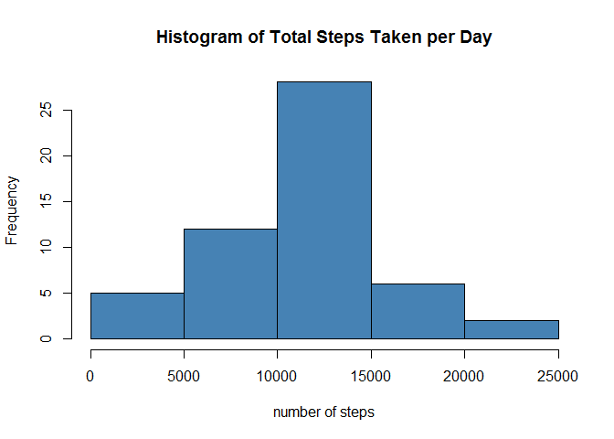
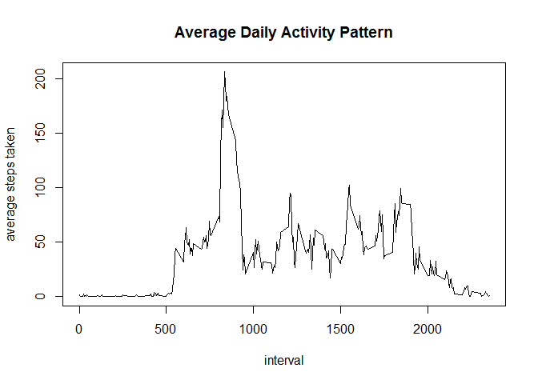
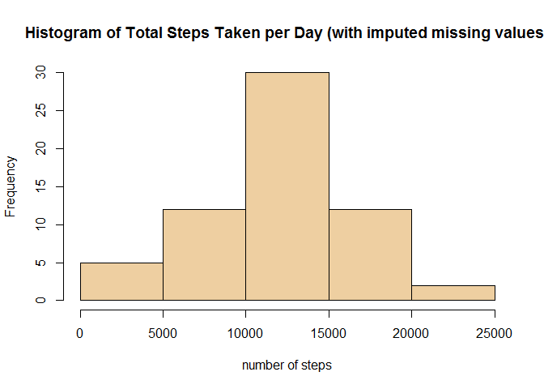
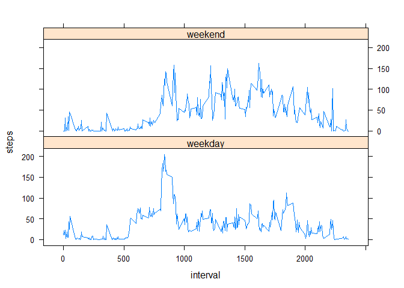

# Reproducible Research: Peer Assessment 1

The following code loads the dataset, and subsets it in a separate data frame so that the number of steps is totaled for each date.

## Loading and preprocessing the data

```r
setwd("~/Coursera/Reproducible_Research/activity")
activity <- read.csv("activity.csv")
daily_totals <- aggregate(steps~date, data=activity, sum)
```
## What is mean total number of steps taken per day?

```r
hist(daily_totals$steps,xlab="number of steps", col="steelblue", main = "Histogram of Total Steps Taken per Day")
```

 

```r
mean(daily_totals$steps)
```

```
## [1] 10766.19
```

```r
median(daily_totals$steps)
```

```
## [1] 10765
```

## What is the average daily activity pattern?

The 'intervals' object includes the means over all days for each interval.


```r
intervals <- aggregate(steps~interval, data=activity, mean)
plot(intervals,type="l",ylab="average steps taken",main="Average Daily Activity Pattern")
```

 

```r
max(intervals$interval)
```

```
## [1] 2355
```

## Imputing missing values

```r
summary(activity)
```

```
##      steps                date          interval     
##  Min.   :  0.00   2012-10-01:  288   Min.   :   0.0  
##  1st Qu.:  0.00   2012-10-02:  288   1st Qu.: 588.8  
##  Median :  0.00   2012-10-03:  288   Median :1177.5  
##  Mean   : 37.38   2012-10-04:  288   Mean   :1177.5  
##  3rd Qu.: 12.00   2012-10-05:  288   3rd Qu.:1766.2  
##  Max.   :806.00   2012-10-06:  288   Max.   :2355.0  
##  NA's   :2304     (Other)   :15840
```

```r
sum(!complete.cases(activity))
```

```
## [1] 2304
```

Missing values were automatically imputed using the 'mice' package.


```r
library(mice)
```

```
## Loading required package: Rcpp
## Loading required package: lattice
## mice 2.22 2014-06-10
```

```r
imputed_activity <- complete(mice(activity,m=1))
```

```
## 
##  iter imp variable
##   1   1  steps
##   2   1  steps
##   3   1  steps
##   4   1  steps
##   5   1  steps
```

```r
imp_daily_totals <- aggregate(steps~date, data=imputed_activity, sum)
hist(imp_daily_totals$steps,xlab="number of steps",col="navajowhite2",main="Histogram of Total Steps Taken per Day (with imputed missing values)")
```

 

```r
mean(imp_daily_totals$steps)
```

```
## [1] 11490.74
```

```r
median(imp_daily_totals$steps)
```

```
## [1] 11458
```

The calculated mean and median are higher when the NAs are replaced with imputed values.

## Are there differences in activity patterns between weekdays and weekends?

```r
days <- weekdays(as.Date(imputed_activity$date))
days[days %in% c("Saturday","Sunday")] <- "weekend"
days[! days %in% "weekend"] <- "weekday"
days <- as.factor(days)
imputed_activity$status <- days
```

```r
attach(imputed_activity)
reshaped_data <- aggregate(imputed_activity,by=list(interval=interval,status=status),FUN=mean)
reshaped_data <- reshaped_data[1:4]
```

```r
xyplot(steps~interval|status,data=reshaped_data,type="l",layout=c(1,2))
```

 
